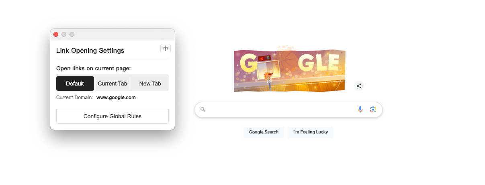
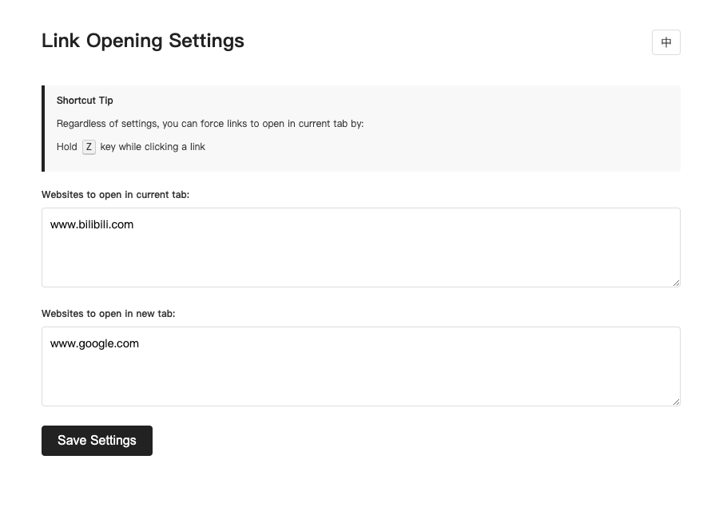

[English](README.md) | [中文](README_CN.md)

# Link Opening Manager Extension

A simple Chrome extension that allows you to customize how links are opened on websites, supporting opening links in the current tab or a new tab.

## Features

- Set link opening preferences for websites
- Support two opening methods: open in current tab, open in new tab
- Support unified rule configuration for batch management of multiple websites
- Support shortcut key: hold Z key while clicking a link to force it to open in the current tab
- Support switching between Chinese and English interfaces

## Installation

1. Download the [zip file](https://github.com/jadon7/TabLink/releases/download/0.0.1/TabLink.zip) and unzip it
2. Open Chrome browser and navigate to the extensions page (`chrome://extensions/`)
3. Enable "Developer mode" in the top right corner
4. Click "Load unpacked"
5. Select the folder of this repository

## Usage

### Quick Settings (Current Website)

1. Click the extension icon on the webpage to open the floating UI
2. Choose the link opening method for the current website: Default, Current Tab, or New Tab

### Global Rules Configuration

1. Click the "Configure Global Rules" button in the floating UI, or right-click the extension icon and select "Options"
2. In "Websites to open in current tab", enter domain names, one per line
3. In "Websites to open in new tab", enter domain names, one per line
4. Click the "Save Settings" button

### Temporary Override

- To temporarily open a link in the current tab (regardless of settings), hold the Z key while clicking the link

### Language Switching

- Click the language button ("EN" or "中") in the top right corner of the interface to switch the interface language

## Setting Details

- Domain matching supports exact match, subdomain match, main domain match, and wildcard match
- Input URLs will be automatically standardized to pure domain format, such as `example.com`
- After initial installation, no domain rules are set by default

## Notes

- If the extension does not work properly, try refreshing the page