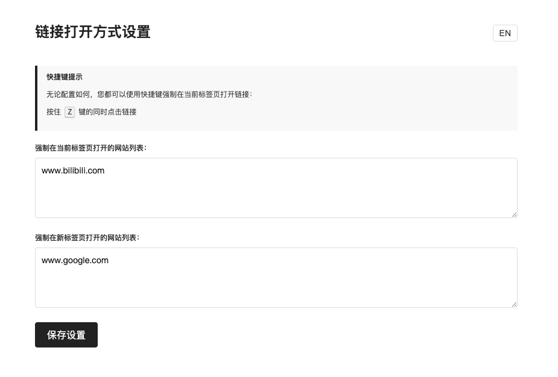

[English](README.md) | [中文](README_CN.md)

# 链接打开方式管理扩展

一个简单的Chrome扩展程序，可以自定义网站链接的打开方式，强制在当前页打开页面或在新的标签页打开页面。
Chrome 商店版本正在审核中

## 功能

- 可以为网站设置链接打开方式
- 支持两种打开方式：当前标签页打开、新标签页打开
- 支持统一规则配置，批量管理多个网站
- 支持快捷键：按住 Z 键的同时点击链接，强制在当前标签页打开
- 支持中英文界面切换

## 安装方法

1. 下载[压缩包](https://github.com/jadon7/TabLink/releases/download/0.0.1/TabLink.zip)并解压
2. 打开Chrome浏览器，转到扩展程序页面 (`chrome://extensions/`)
3. 开启右上角的"开发者模式"
4. 点击"加载已解压的扩展程序"
5. 选择此仓库的文件夹

## 使用方法

### 快速设置（当前网站）

1. 在网页上点击扩展图标，打开浮层UI
2. 选择当前网站的链接打开方式：不设置、当前标签页或新标签页

### 全局规则设置

1. 点击浮层UI中的"配置全局规则"按钮，或右键点击扩展图标选择"选项"
2. 在"强制在当前标签页打开的网站列表"中，输入域名，每行一个
3. 在"强制在新标签页打开的网站列表"中，输入域名，每行一个
4. 点击"保存设置"按钮

### 临时覆盖设置

- 如需临时在当前标签页打开链接（无论配置如何），可按住 Z 键的同时点击链接

### 语言切换

- 点击界面右上角的语言按钮（"EN"或"中"）即可切换界面语言

## 设置说明

- 域名匹配支持精确匹配、子域名匹配、主域名匹配和通配符匹配
- 输入的URL会自动标准化为纯域名格式，如 `example.com`
- 初次安装后，默认没有设置任何域名规则

## 注意事项

- 如果扩展无法正常工作，请尝试刷新页面